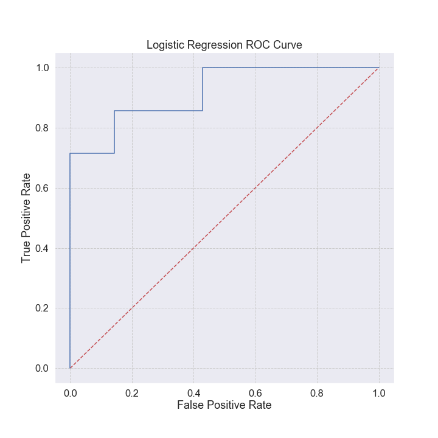

# Case study: Salary vs Education

__EDA, linear and logistic regression, and partial-dependence plots.__ 

Construction and analyses of supervised learning models for a data set with numerical and categorical values.

[]

---